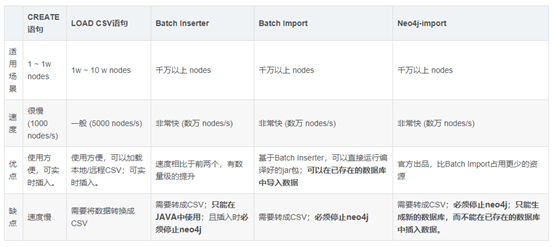
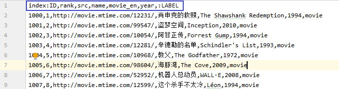
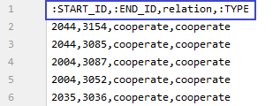
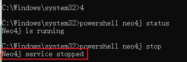
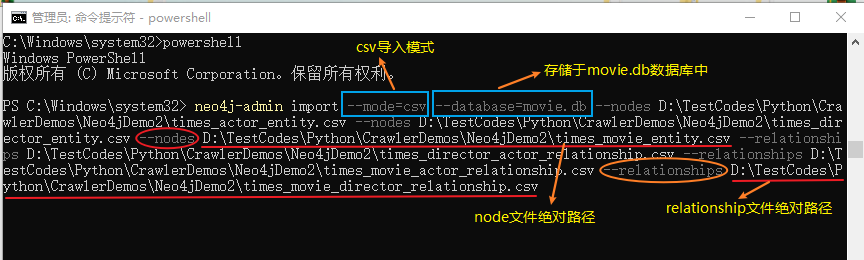
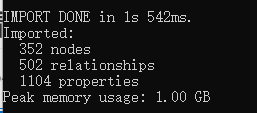
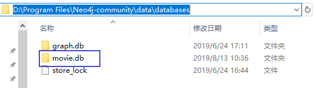
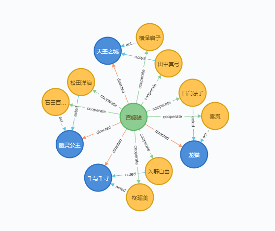

# Python+Neo4j构建时光网TOP100电影知识图谱

## 环境

**1、Neo4j 3.5.6（2019年6月25日）**

**2、Java 1.8.0_181**

**3、Annaconda 3**


## 一、准备工作

Neo4j安装：https://blog.csdn.net/gggggao/article/details/93595137

## 二、节点关系分析

**目的：**学习并尝试构建知识图谱，选择时光网的电影排名[^img2.1]做尝试。

**时光网链接：** http://www.mtime.com/top/movie/top100/


数据导入neo4j的方式有四种[^img2.2]，因为节点数量不多，所以采用**LOAD CSV**的方式来进行导入



查看并分析网页源代码之后，确定爬取的节点和关系对象如下：

```
节点:
	|----电影
			|----index:ID
			|----properity: rank, src, name, movie_en, year
			|----label
	|----导演
			|----index:ID
			|----properity: director
			|----label
	|----演员
			|----index:ID
			|----properity: actor
			|----label


关系:
	|----电影<--导演
				  |----start:START_ID
				  |----end:END_ID
				  |----properity: relation
				  |----type:TYPE
	|----电影<--演员
				  |----start:START_ID
				  |----end:END_ID
				  |----properity: relation
				  |----type:TYPE
	|----演员-->导演
				  |----start:START_ID
				  |----end:END_ID
				  |----properity: relation
				  |----type:TYPE
```


## 三、构建电影知识图谱

### 3.1 爬取数据

#### 3.1.1 下载网页

本文采用BeautifulSoup来进行数据爬取，首先下载url的html文件

```python
def download_page(url):
    headers = {'User-Agent': 'Mozilla/5.0 (Macintosh; Intel Mac OS X 10_11_2) AppleWebKit/537.36 (KHTML, like Gecko) Chrome/47.0.2526.80 Safari/537.36'}
    return requests.get(url, headers = headers).content
```

#### 3.1.2 解析网页

接着对下载的网页进行解析，得到全部电影信息的list，也就是movie_list

```python
def parse_timesmovie_html(html):
    soup = BeautifulSoup(html, features="lxml")     #parse tool: BeautifulSoup
    movie_list = []  # movie_node list: sava all the movie info into the list
    movie_list_soup = soup.find('ul', attrs={'id':'asyncRatingRegion'})     #find body
    #get the data of: rank, movie_name, src, director, movie_actor[]; then save in the
    for movie_li in movie_list_soup.find_all('li'):
        rank = movie_li.find('div', attrs={'class': 'number'}).getText()   #rank of movie
        movie_info = movie_li.find('div', attrs={'class': 'mov_con'})
        movie_temp = movie_info.find('a').getText().split("\xa0")     #name of movie
        movie_name = movie_temp[0]
        year = movie_temp[1].split(" ")[-1].replace('(','').replace(')','')       #release date of movie
        movie_en_name = movie_temp[1][:-7]  #English name of movie
        #print(movie_en_name)
        src = movie_info.find('a')['href']      #src of movie
        # extract the infomation of director&actor
        person_info = movie_info.select('p')
        # director of movie
        director = person_info[0].find('a').string
        # actors of movie
        movie_actor = []
        for act in person_info[1].find_all('a'):
            movie_actor.append(act.string)

        movie_info_all = {'rank': rank,
                      'src': src,
                      'movie_name': movie_name,
                      'movie_en_name': movie_en_name,
                      'year': year,
                      'director': director,
                      'actor': movie_actor
                      }
        movie_list.append(movie_info_all)
    return movie_list
```

#### 3.1.3 处理重复节点

我们知道，会存在一个导演拍了多部电影，或者一个演员演了多部电影的情况存在，因此，我们需要对可能会重复的节点（导演和演员）进行处理，并返回节点的字典

```python
def handle_entity(person_list):
    director_list, actor_list = [], []
    dir_dic, actor_dic = {}, {}

    # separate infomation from person_list
    for elm in person_list:
        director_list.append(elm['director'])
        actor_list.extend(elm['actor'])
    #utilize set() to remove duplicate data from the list[]
    director_set=set(director_list)
    actor_set = set(actor_list)
    #save data to the dictionary
    for index,value in enumerate(director_set):
        dir_dic[index] = value
    for index,value in enumerate(actor_set):
        actor_dic[index] = value
    
    return dir_dic, actor_dic
```

### 3.2 生成csv文件

#### 3.2.1 生成节点csv文件

根据上面的分析我们要生成3个节点的csv文件，分别是

- 电影：times_movie_entity.csv
- 导演：times_director_entity.csv
- 演员：times_actor_entity.csv

代码如下所示

```python
#times_movie_entity.csv
def save_movie_entity(movie_entity_list):
    data = pd.DataFrame({'index:ID': [index+1000 for index in range(len(movie_entity_list))],
                         'rank': [movie['rank'] for movie in movie_entity_list],
                         'src': [movie['src'] for movie in movie_entity_list],
                         'name': [movie['movie_name'] for movie in movie_entity_list],
                         'movie_en': [movie['movie_en_name'] for movie in movie_entity_list],
                         'year': [movie['year'] for movie in movie_entity_list],
                         ':LABEL': 'movie'
                         })
    data.to_csv(r'./times_movie_entity.csv', index=False)

#times_director_entity.csv
def save_director_entity(director_entity_dic):
    data = pd.DataFrame({'index:ID': [item+2000 for item in director_entity_dic.keys()],
                         'director': [val for val in director_entity_dic.values()],
                         ':LABEL': 'director'
                         })
    data.to_csv(r'./times_director_entity.csv', index=False)

#times_actor_entity.csv
def save_actor_entity(actor_entity_dic):
    data = pd.DataFrame({'index:ID': [item+3000 for item in actor_entity_dic.keys()],
                         'actor': [val for val in actor_entity_dic.values()],
                         ':LABEL': 'actor'
                         })
    data.to_csv(r'./times_actor_entity.csv', index=False)
```

> **注意：**
>
> 为了很好的区分三个节点，我们对他们的index进行处理，分别加了1000、2000和3000，也就是
>
> - $$index(movie) \in [1000,1999]$$
> - $$index(director) \in [2000,2999]$$
> - $$index(actor) \in [3000,3999]$$
>
> 节点文档格式规则 [^2]

生成的times_movie_entity.csv文件格式见[^img3.1]



#### 3.2.2 生成关系csv文件

根据3.2.1生成的节点文件，我们继续生成它们的3个关系文件，分别是

- 电影<--导演：times_movie_director_relationship.csv
- 电影<--演员：times_movie_actor_relationship.csv
- 演员-->导演：times_director_actor_relationship.csv

代码如下所示

```python
#times_movie_director_relationship.csv
def save_movie_director_relationship(movie_list, movie_dic, director_dic):
    data = pd.DataFrame({':START_ID': [list(director_dic.keys())[list(director_dic.values()).index(info['director'])]+2000 for info in movie_list],
                         ':END_ID': [list(movie_dic.keys())[list(movie_dic.values()).index(info['movie_name'])] for info in movie_list],
                         'relation': 'directed',
                         ':TYPE':'directed'
                         })
    data.to_csv(r'./times_movie_director_relationship.csv', index=False)

#times_movie_actor_relationship.csv
def save_movie_actor_relationship(movie_list, movie_dic, actor_dict):
    relation_list = []
    for movie in movie_list:
        for actor_info in movie['actor']:
            actor_index = list(actor_dict.keys())[list(actor_dict.values()).index(actor_info)]
            movie_index = list(movie_dic.keys())[list(movie_dic.values()).index(movie['movie_name'])]
            info = {
                    'actor_index': actor_index,
                    'movie_index': movie_index
            }
            relation_list.append(info)

    data = pd.DataFrame({':START_ID': [relation['actor_index']+3000 for relation in relation_list],
                         ':END_ID': [relation['movie_index'] for relation in relation_list],
                         'relation': 'acted',
                         ':TYPE': 'acted'
                         })
    data.to_csv(r'./times_movie_actor_relationship.csv', index=False)

#times_director_actor_relationship.csv
def save_director_actor_relationship(movie_list, director_dic, actor_dict):
    relation_list = []
    for movie in movie_list:
        for actor_info in movie['actor']:
            actor_index = list(actor_dict.keys())[list(actor_dict.values()).index(actor_info)]
            dir_index = list(director_dic.keys())[list(director_dic.values()).index(movie['director'])]
            info = {
                'actor_index': actor_index,
                'dir_index': dir_index
            }
            relation_list.append(info)

    data = pd.DataFrame({':START_ID': [relation['dir_index']+2000 for relation in relation_list],
                         ':END_ID': [relation['actor_index']+3000 for relation in relation_list],
                         'relation': 'cooperate',
                         ':TYPE': 'cooperate'
                         })
    data.to_csv(r'./times_director_actor_relationship.csv', index=False)
```

生成的times_director_actor_relationship.csv文件格式见[^img3.2]



### 3.3 构建图谱

#### 3.3.1 准备工作

在导入之前要先关闭neo4j服务

- 以管理员身份打卡命令提示符
- 查看neo4j状态，如果是运行状态则将其关闭[^img3.3]



#### 3.3.2 生成图谱

服务关闭之后我们导入文件，如下图[^img3.4]所示，



命令如下所示：

```
neo4j-admin import --mode=csv --database=movie.db --nodes D:\TestCodes\Python\CrawlerDemos\Neo4jDemo2\times_actor_entity.csv --nodes D:\TestCodes\Python\CrawlerDemos\Neo4jDemo2\times_director_entity.csv --nodes D:\TestCodes\Python\CrawlerDemos\Neo4jDemo2\times_movie_entity.csv --relationships D:\TestCodes\Python\CrawlerDemos\Neo4jDemo2\times_director_actor_relationship.csv --relationships D:\TestCodes\Python\CrawlerDemos\Neo4jDemo2\times_movie_actor_relationship.csv --relationships D:\TestCodes\Python\CrawlerDemos\Neo4jDemo2\times_movie_director_relationship.csv
```

导入成功[^img3.5]并打开服务



## 四、图谱效果查看

命令成功运行之后多了一个neo4j数据库：**movie.db**[^img4.1]里面存放着我们的刚刚成功存储的数据。



为了能把数据加载出来，我们接着进conf[^img4.2]设置默认加载的数据库


打开neo4j.conf，输入 ```dbms.active_database=movie.db```，如下所示[^img4.3]


最后我们输入Cyper语句查询宫崎骏图谱，Cyper语句如下所示：

```match m=(:director{director:'宫崎骏'})-[*..1]-() return m```

查询结果如图所示[^img4.3]



## 五、Github

代码github地址：https://github.com/Gao0505/timesMovieKG

## 参考

[1]: https://blog.csdn.net/BF02jgtRS00XKtCx/article/details/89078048	"爬取豆瓣电影榜单构建知识图谱"
[2]: https://blog.csdn.net/sinat_25479505/article/details/80996402	"Neo4j Import 数据导入"

